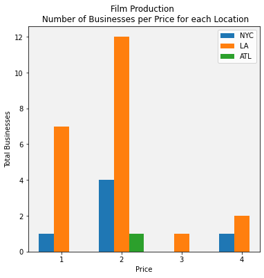
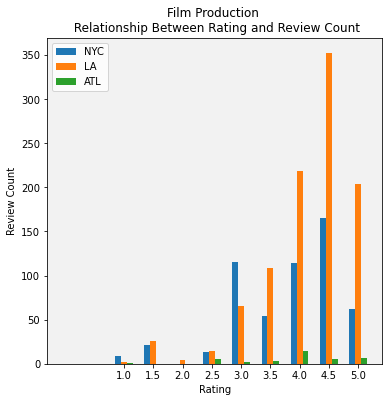
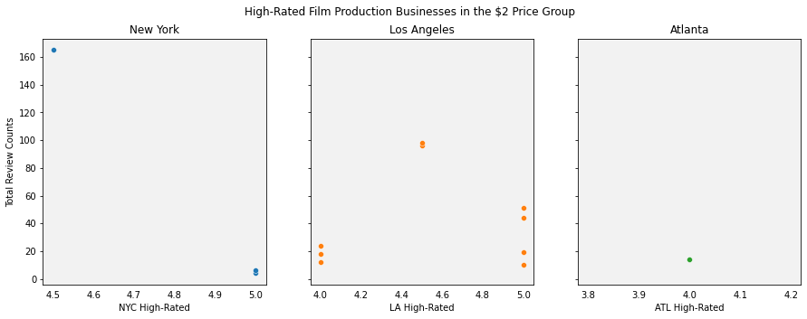

# Yelp_Jake_Mike_Phase_1
Phase 1 Yelp project between peers Jake Ash and Mike Flanagan.

Hello! Thank you for visiting this repository!

This is an early-stage project with the goal to analyze business opportunities using data from the Yelp API.

Using this publicly available data, we hope to apply a bit of statistical analysis to see what sort of opportunities are present in several locales.

Ultimately, with insights attained from the data gathered with the Yelp API, we will compare opportunities between two locations. 

Please check back in sometime soon for a completed presentation. We will have a summary pitchbook available to download as a PDF within our reposity. 
And of course, if you are interested in any of the technical aspects of our project, feel free to check out any of our .ipynb and .py files.
We will do our best to keep non-technical explanations and our reasoning illustrated alongside our code. 

If you have any questions or inquiries, feel free to reach out to us via our github accounts!

https://github.com/jakeash22/
https://github.com/mike-flanagan/

## Overview 

For over a centery, film, television & media production was ubiquitous in, and almost exclusive to, two major US metropolises: Los Angeles and New York. Over the past several decades, there have been many developments that have cracked this exclusivity: The advent of the internet has increased access to entertainment, while simultaneously inspiring a new generation of creators. Other advances in technology have allowed film-industry-standard production quality to be capable with devices that are commonplace with today's consumer. Further, state governments have begun competing to attract business with tax credits designed to lure productions to within their borders, where no production industry existed before.

With the help of business insights provided by the Yelp API, we will take a glimpse at this industry, comparing companies that offer production services in a few locations. Out goal is to find what business opportunities appear to be present within this industry, and ultimately, develop a business with what we find.

If we could create the perfect business, it would be popular and loved to the point of being a house-hold brand, which everyone finds welcome in their lives. The only way to do this is to ensure that the service that we provide is so excellent, that our customers love us with no reservation for the cost, because we would be providing something that is incredibly valuable.

## Business Curisoty

New York and Los Angeles are still the dominant cities in film, however Atlanta is becoming more and more of a powe player in the industry. Comparing these three cities, we are set on determing which market will allow us to prosper.

## Data

Yelp allows the public to recieve data on compaines world wide, and allows the user to interact with their data in many ways. The data provides price range, location, reviews, and how many people reviewed that business.

## Methods

This project uses descriptive statistics to see what opportunities are revealed to exist with the use of the Yelp API, between New York City, Los Angeles, and Atlanta.

## Results 

A majority of the production houses fall under Yelp's unique price range of 1-$ or 2-$$.

Even though Atlanta is on the up and coming in the film industry, they are still dwarfed in comparison to New York and Los Angeles. Atlanta's total reviews are miniscule in comperison to New York City and Los Angeles.  It is also shown in the graph that the higher the review rate, the more total reviews the company recieves. 

A sweet spot for a company is to land in the high review score and count values, while having low prices.  The graph below shows the "Unicorns" of each city, where the business has hit the sweetspot of low prices and high reviews.  These companies can be a great blueprint for any company looking to break into that market.

## Conclusions

The anaylsis led us not only which city to pick, but also the exact type of business and relationship we want with others in the industry. We decided that a symbiotic relationship with DiJiFi, a film digitizing and photography company based in New York City, is the best option. We will provide rental equipment for film productions & photoshoots, which will synergize well with the beloved DiJiFi customers.

### Next Steps

- commercial real estate prices per location (possibly through other APIs such as Zillow)
- webscraping the data from websites of our largest competition 
- other costs of doing business per location
- resources available per location that will help in starting a business, i.e:
  - other businesses that may be used as resources to ours
  - local tax-incentives for film industry
- with insights beyond the scope of this project, a business-friendly regulator relationship would be considered